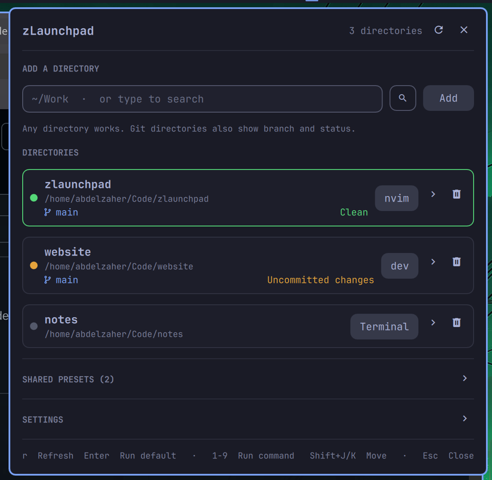

# zLaunchpad

Pin any directory to the Omarchy bar and launch commands in it. Git
directories also show their branch and whether the worktree is clean.



## What it does

- **Any directory.** Not just Git checkouts — a path only has to exist and be a
  directory.
- **Git state when present.** Branch plus `Clean` / `Uncommitted changes`, from
  `git status --porcelain=v2 --branch`. Non-Git directories get a neutral dot.
- **Two buttons per directory.** The first runs that directory's *default
  command*; the second (`›`) opens a drawer with its other commands, the shared
  presets, reordering, and the editors for all of it.
- **Shared presets.** A global command list, shown in every drawer. Run one in
  place, or copy it into a directory.
- **Placeholders.** `dx {name}` runs `dx api` in one directory and `dx website`
  in the next, so one preset covers every project.
- **Fuzzy directory search** in the add field, plus a full `fzf` picker.
- **Global keybind**, recorded in the panel and written to Hyprland for you.

## Requirements

- Omarchy 4 (Quickshell-based shell) on Hyprland.
- `git` for branch and status of Git directories.
- A terminal exposing `xdg-terminal-exec` (Omarchy ships one).
- Optional: `fd` for fast directory search (falls back to `find`), `fzf` for the
  full-screen picker.

## Install

```bash
omarchy plugin add https://github.com/AbdelzaherAbdelgwad/omarchy-zlaunchpad
omarchy plugin enable io.github.abdelzaherabdelgwad.zlaunchpad right
```

> On Omarchy 4.0.0.alpha, `omarchy plugin enable` has been seen to rewrite
> `~/.config/omarchy/shell.json` from the default template, dropping an existing
> bar layout. Back that file up first, or add the entry by hand:
>
> ```bash
> jq '.bar.layout.right += [{"id":"io.github.abdelzaherabdelgwad.zlaunchpad"}]' \
>   ~/.config/omarchy/shell.json > /tmp/shell.json && mv /tmp/shell.json ~/.config/omarchy/shell.json
> ```

## Removal

```bash
omarchy plugin disable io.github.abdelzaherabdelgwad.zlaunchpad
omarchy plugin remove io.github.abdelzaherabdelgwad.zlaunchpad
```

That leaves two files behind, both safe to delete:

```bash
rm -rf ~/.local/share/omarchy-launchpad          # pinned directories and presets
rm -f ~/.local/state/omarchy/toggles/hypr/zlaunchpad.lua && hyprctl reload   # the keybind
```

Nothing else is touched: pinned directories themselves are never modified, and
the plugin writes no other user configuration.

## Using it

**Pin a directory.** Type a path, or two or more characters to search. Search
runs `fd --type directory` rooted at `$HOME`: the last typed segment fuzzy-
matches directory *names*, earlier segments filter by path, so `code/api` means
"a directory named ~api under a path matching code". Results rank exact name
first, then names containing the text, then shallower paths. `󰍉` opens the full
`fzf` picker in a terminal and hands the selection back over IPC.

**Run something.** The default button runs the directory's default command. The
drawer lists the rest — click to run, `󰐃` to promote one to default, `󰅖` to
remove.

### How commands run

Every command opens a terminal at the directory:

```
xdg-terminal-exec --dir=<path> -- bash -lc '<command>'
```

An empty command just opens the terminal.

**Hold** decides what happens when the command exits. Off, the terminal closes
immediately — right for `nvim`, `lazygit`, a shell. On, `exec "$SHELL" -l` is
appended so the window stays open with a login shell and the output stays
readable — right for `git pull`, `make`, `docker compose up`.

### Placeholders

Click a chip under any command field to insert one:

| Token | Value |
|-------|-------|
| `{name}` | the directory's display name |
| `{path}` / `{dir}` | full path |
| `{basename}` | last path segment |
| `{parent}` | parent directory |
| `{branch}` | current Git branch (empty for non-Git) |

Values are passed as positional arguments and the tokens expand to shell
variables (`"$LP_NAME"`, `"$LP_PATH"`, …), so a directory name with spaces or
quotes stays one literal word — nothing is pasted into the script text.

### Keyboard

| Key | Action |
|-----|--------|
| `Enter` | run the selected directory's default command |
| `1`–`9` | run that command of the selected directory |
| `j` / `k`, arrows | move the selection |
| `Shift+J` / `Shift+K` | move the selected directory down / up |
| `r` | refresh Git state |
| `Esc` | close |

### Settings

**Global keybind** — press *Record*, then the combination. It is written as
`~/.local/state/omarchy/toggles/hypr/zlaunchpad.lua`:

```lua
o.bind("SUPER + SHIFT + L", "zLaunchpad", "omarchy-shell io.github.abdelzaherabdelgwad.zlaunchpad toggle")
```

Omarchy's Hyprland config is Lua and loads every `*.lua` in that directory, so
no user config file is edited; `hyprctl reload` applies it. (`hyprctl keyword`
is refused on this setup — "keyword can't work with non-legacy parsers".)

**Auto-refresh** — Git state refreshes every N seconds while the panel is open.
A refresh that finds nothing new leaves the model alone, so it never disturbs
a half-typed command. Turn it off to refresh only with `r`.

## IPC

```bash
omarchy-shell io.github.abdelzaherabdelgwad.zlaunchpad toggle        # open / close / refresh
omarchy-shell io.github.abdelzaherabdelgwad.zlaunchpad add ~/Work    # pin a directory
omarchy-shell io.github.abdelzaherabdelgwad.zlaunchpad remove ~/Work # unpin one
omarchy-shell io.github.abdelzaherabdelgwad.zlaunchpad list          # JSON summary
omarchy-shell io.github.abdelzaherabdelgwad.zlaunchpad keybind "SUPER SHIFT, L"
```

## Widget settings (`shell.json`)

| Key | Default | Meaning |
|-----|---------|---------|
| `showGitStatus` | `true` | show branch and clean/dirty line |
| `showPaths` | `true` | show the full path under each name |

## State

`$XDG_DATA_HOME/omarchy-launchpad/state.json` (default
`~/.local/share/omarchy-launchpad/state.json`), written atomically:

```json
{
  "version": 1,
  "entries": [
    {
      "path": "/home/you/Code/zlaunchpad",
      "name": "zlaunchpad",
      "isGit": true,
      "branch": "main",
      "dirty": false,
      "defaultCommand": { "label": "nvim", "command": "nvim .", "keepOpen": false },
      "commands": [{ "label": "lazygit", "command": "lazygit", "keepOpen": false }]
    }
  ],
  "presets": [{ "label": "Pull", "command": "git pull", "keepOpen": true }],
  "prefs": { "keybind": "SUPER SHIFT, L", "autoRefresh": true, "autoRefreshSec": 15 }
}
```

Invalid JSON surfaces an error in the panel and is never overwritten.

## What it runs

- `git -C <path> status --porcelain=v2 --branch` and `git log -1` for Git state,
  always with `core.hooksPath=/dev/null` and `core.fsmonitor=false` so a
  repository's own config cannot turn a status check into code execution.
- `realpath -e` and `stat -c %F` to validate a directory before pinning.
- `fd` (or `find`) for directory search.
- `xdg-terminal-exec` for the commands **you** configure. Those run through
  `bash -lc` by design; paths and placeholder values are passed as arguments,
  never interpolated into the script.
- `hyprctl reload` when you set or clear the keybind.

No network access, no telemetry, nothing outside your machine. Like every
Omarchy plugin it runs unsandboxed inside the shell process — read the source
before installing.

## Development

```bash
./tests/run          # manifest contract, qmllint, safety invariants, omarchy plugin validate
```

## License

MIT — see [LICENSE](LICENSE).
